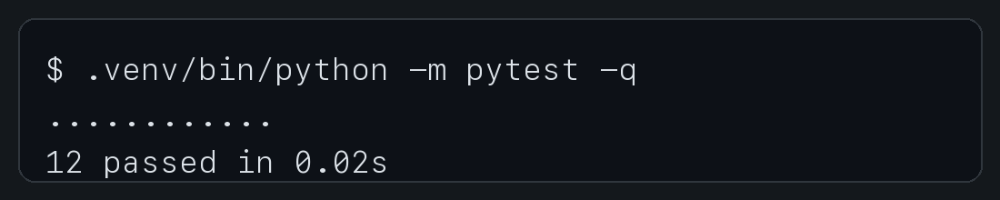
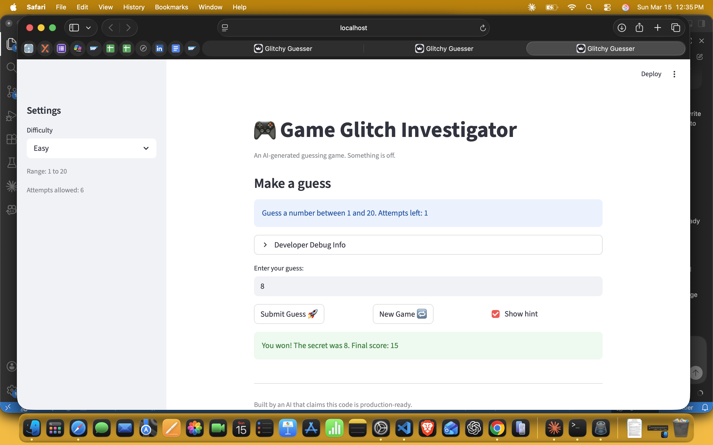

# 🎮 Game Glitch Investigator: The Impossible Guesser

## 🚨 The Situation

You asked an AI to build a simple "Number Guessing Game" using Streamlit.
It wrote the code, ran away, and now the game is unplayable.

- You can't win.
- The hints lie to you.
- The secret number seems to have commitment issues.

## 🛠️ Setup

1. Install dependencies: `pip install -r requirements.txt`
2. Run the app: `python -m streamlit run app.py`

## 🕵️‍♂️ Your Mission

1. **Play the game.** Open the "Developer Debug Info" tab in the app to see the secret number. Try to win.
2. **Find the State Bug.** Why does the secret number change every time you click "Submit"? Ask ChatGPT: *"How do I keep a variable from resetting in Streamlit when I click a button?"*
3. **Fix the Logic.** The hints ("Higher/Lower") are wrong. Fix them.
4. **Refactor & Test.**
   - Move the logic into `logic_utils.py`.
   - Run `pytest` in your terminal.
   - Keep fixing until all tests pass.

## 📝 Document Your Experience

### Game Purpose

The purpose of this project is to debug and repair a broken Streamlit number guessing game that was originally generated by AI. The game lets the user choose a difficulty, guess a secret number, and receive higher/lower feedback until they win or run out of attempts. The main learning goal was not just fixing the app, but understanding how state, logic bugs, and testing work together in a real debugging workflow.

### Bugs Found

- The hint messages were reversed, so the game sometimes told the player to move in the wrong direction.
- The attempts counter was off, so the number shown to the player did not match the guesses actually available.
- Starting a new game did not fully reset the session state, so the app could stay stuck after a win or loss.
- The game logic lived inside `app.py` while `logic_utils.py` was still unimplemented, so the codebase and tests were out of sync.
- Decimal guesses were silently converted into integers instead of being rejected as invalid input.

### Fixes Applied

- Moved `get_range_for_difficulty`, `parse_guess`, `check_guess`, and `update_score` into `logic_utils.py`.
- Updated `app.py` to import the refactored logic and keep the UI and state management separate from the core game logic.
- Fixed the reversed high/low hint bug so feedback now matches the guess outcome correctly.
- Reworked the new game flow so `secret`, `attempts`, `score`, `status`, and `history` all reset together.
- Corrected attempt counting and updated the UI text so the displayed range matches the selected difficulty.
- Added automated tests for win/lose logic, hint direction, decimal input validation, out-of-range values, and high-score persistence.

## ✅ Verification

I verified the repairs in two ways:

1. Automated testing with `pytest`
2. Manual runtime verification with Streamlit

### Pytest Results

```text
$ .venv/bin/python -m pytest -q
............                                                             [100%]
12 passed in 0.02s
```

### Pytest Evidence



### Manual App Check

I launched the app with Streamlit and confirmed that it started successfully, accepted guesses, and reset properly when starting a new game.

## 📸 Demo

### Earlier Screenshot With Debug Panel



### Final Winning Game Screenshot


### Notes

- An earlier version of the app exposed the secret number through the `Developer Debug Info` panel, which made the game trivial to win.
- I kept the earlier screenshot for comparison and then removed the debug panel from the final version.
- The final screenshot shows the repaired game reaching a successful winning state without revealing the secret number.
- Pytest verification is included both as terminal output and as an image artifact in this repository.

## 🚀 Stretch Features

### Challenge 1: Advanced Edge-Case Testing

I expanded the test suite from a few basic checks to a broader set of edge cases. The new tests cover decimal input, negative numbers, extremely large values, temperature labels, guess-history formatting, and saved high score behavior. The final result is a 12-test suite that exercises both bug fixes and extension logic.

### Challenge 2: Feature Expansion via Agent Mode

I added a high-score tracker that saves the best score to `high_score.json`, plus a guess-history view that records each guess, its outcome, distance from the secret, and a hot/cold label. The AI contribution is documented directly in the code near the session summary feature, where the UI table was added after AI-assisted planning and then refined manually.

### Challenge 3: Professional Documentation and Linting

Every function in `logic_utils.py` now has a real docstring that explains its purpose and return behavior. I also cleaned up the module structure and naming so the code is easier to read and follows normal Python style conventions more closely. I verified the updated files still parse cleanly with `python -m py_compile`.

### Challenge 4: Enhanced Game UI

The app now has stronger player feedback with color-coded result cards, hot/cold labels, a score panel, a high-score metric, and a session summary table. These changes improve the player experience without changing the core guessing-game rules. The README demo image shows the repaired game in a winning state, and the current code includes the expanded UI elements.

### Challenge 5: AI Model Comparison

I compared the way different AI tools helped with the debugging process in the reflection. The short version is that both models were helpful, but one was stronger for readable code changes while the other was stronger at explaining why the bug happened. The full comparison is documented at the bottom of `reflection.md`.
